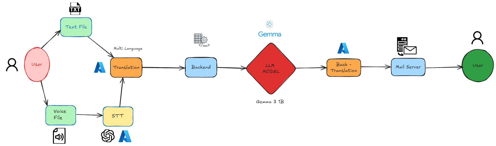

# 🧠 Meeting Summarizer (NLP Project)

A full-stack NLP project for generating high-quality meeting summaries using transformer models. It includes dataset preparation, model fine-tuning, backend deployment, and a frontend interface. The entire stack leverages Groq + LLaMA for inference and Gemma for fine-tuning.

---

## 🎥 Demo

You can check it out in a [Video Demo](https://youtu.be/N85zmYQjBEA)!

---

## 📁 Project Structure

```
.
├── backend/                      # Backend notebook and server
│   └── backend.ipynb
├── frontend/                     # React-based user interface
│   ├── src/
│   │   └── App.jsx               # Set NGROK URL here
├── model/                        # Fine-tuning and model-related scripts
│   ├── requirements.txt
│   └── train.ipynb
├── dataset/                      # Dataset generation and raw data
│   ├── dataset_generation.ipynb
│   └── meetingbank_final_llama4.csv
├── tests/                        # Test files and samples
│   └── test_audio.wav
├── assets/                       # Images and visuals
│   └── architecture.png
├── .env.example                  # Template for required environment variables
└── README.md
```

---

## 🚀 Quickstart

### 1. Clone the Repository

```bash
git clone https://github.com/your-username/meeting-summarizer.git
cd meeting-summarizer
```

---

### 2. Generate Dataset

Navigate to `dataset/dataset_generation.ipynb`:

- Loads MeetingBank dataset:
  ```python
  from datasets import load_dataset
  dataset = load_dataset("huuuyeah/meetingbank")
  ```

- Inference using Groq API (`llama-4-scout`)
- Output: `meetingbank_final_llama4.csv`

---

### 3. Fine-tune the Model

In the `model/` folder:

- Install dependencies:

```bash
pip install -r requirements.txt
```

- Open `train.ipynb` and fine-tune the model using:

```python
model_id = "google/gemma-3-1b-it"
# Alternatives: "google/gemma-3-4b-pt", "gemma-3-12b-pt", "gemma-3-27b-pt"
```

---

### 4. Run Backend

Navigate to `backend/backend.ipynb` and run all cells:

```python
from pyngrok import ngrok
import os

NGROK_KEY = os.getenv("NGROK_KEY")
ngrok.set_auth_token(NGROK_KEY)
tunnel = ngrok.connect(8000)
print("Public URL:", tunnel.public_url)
```

> Copy the printed public URL — this is your backend endpoint.

---

### 5. Start Frontend

In the `frontend/` folder:

- Set the backend URL in `src/App.jsx`:

```js
const API_BASE_URL = 'https://xxxx-xx-xx-xxx.ngrok-free.app';
```

- Run frontend:

```bash
npm install
npm run dev
```

---

## 🔐 Environment Variables

Create a `.env` file using `.env.example` and add:

```env
GROQ_API=
HF_API=
AZURE_SPEECH_KEY=
AZURE_TRANSLATE_KEY=
NGROK_KEY=
gmail_user=
gmail_password=   # App password only
```

---

## 📸 Architecture



---

## ✅ Final Notes

- Uses [MeetingBank](https://huggingface.co/datasets/huuuyeah/meetingbank) dataset
- Groq LLaMA-4 used for inference during dataset generation
- Fine-tunes Google’s Gemma models with HuggingFace
- React frontend powered by Vite
- Backend served using `pyngrok` tunnel

---

**Made with 🤍 by Kirtan, Martin and Siddhant**

```
